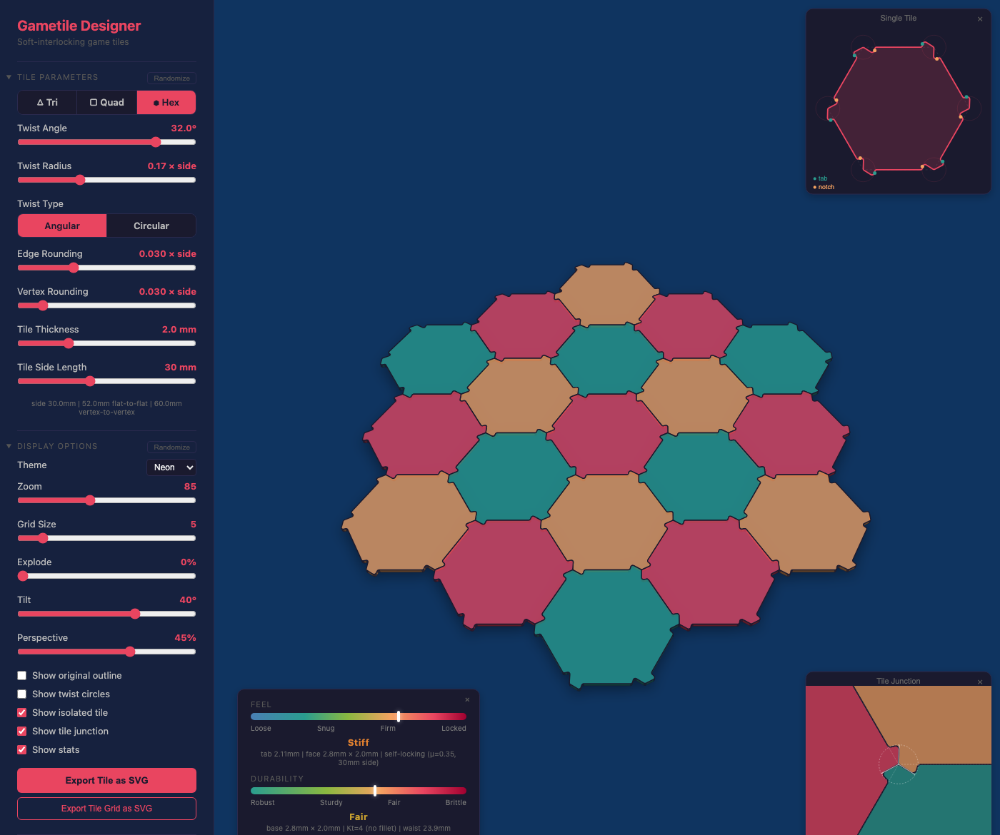

# Gametile Designer

Interactive design tool for laser-cut board game tiles (triangle, square, hexagon) that interlock via a twist mechanism at tile vertex junctions.

**[Try it live](https://heathdutton.github.io/gametile-designer/)**

## Features

- Triangle, square, and hexagon tile shapes
- Adjustable twist angle, radius, and corner rounding
- Angular or arc-based joint geometry
- Physics-based interlock feel and tab durability gauges
- 6 color themes (Neon default)
- 3D tilt with perspective projection
- SVG export (single tile and full grid)
- Tile side length presets for common board game sizes (10–60mm)
- URL state sharing
